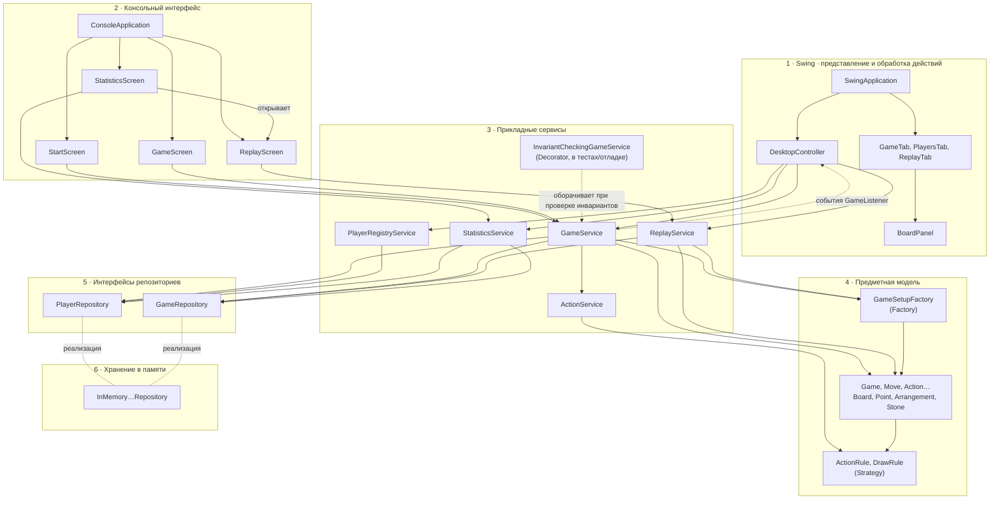
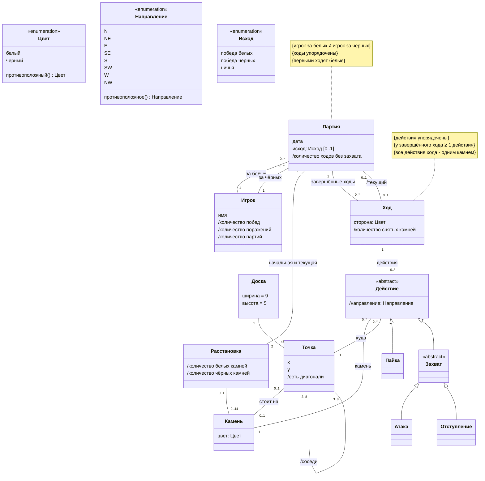

# FanoronaCase

Настольная игра в Фанорону на Kotlin/JVM с графическим интерфейсом Swing. Приложение проверяет ходы, ведёт реестр игроков, показывает локальную статистику и позволяет повторять завершённые партии. Консольный режим также доступен.

В GUI можно выбрать камень и соседнюю точку мышью. Доступные камни и цели подсвечиваются; если возможны и атака, и отступление, приложение предлагает выбрать вид захвата. Имена игроков, история и статистика существуют в памяти текущего запуска.

## Требования

<details>
<summary>Показать требования</summary>

### Правила игры

- Партия начинается с равного количества камней, расположенных на всех точках, кроме центральной.
- Игроки ходят по очереди, первыми - белые.
- Ход - это либо простое перемещение («пайка»), либо захват: «атака» или «отступление».
- Все действия выполняются по линии на соседнюю свободную точку.
- Пайка - единственное действие хода, после неё ход заканчивается.
- За ход можно (не обязательно) сделать несколько захватывающих действий подряд, но:
  - одним и тем же камнем;
  - не посещая одну и ту же точку, включая ту, где камень стоял в начале хода;
  - не перемещаясь два раза подряд в одном направлении.
- **Атака:** камень подходит к камню противника, и снимаются все камни противника подряд в направлении движения - до первой пустой точки или точки, занятой камнем ходящего.
- **Отступление:** камень отходит от камня противника, и по тому же правилу остановки снимаются камни противника, стоящие подряд в противоположном направлении от исходной точки.
- Захват обязателен: если захват возможен, игрок обязан его сделать. Если доступны и атака, и отступление, игрок выбирает сам.

### Доска

- 9 × 5 точек, соединённых линиями, которые задают направления ходов.
- У каждой стороны 22 камня; в среднем ряду камни стоят чередуясь.
- Соединения образуют 8 участков 3 × 3. В каждом участке последовательно связаны крайние точки, и все они связаны с центральной точкой участка.

### Завершение партии

- Игрок побеждает, если захватил все камни противника.
- Ничья объявляется, если выполнено любое из условий:
  - сделано 40 ходов подряд без единого захвата;
  - одна и та же расстановка камней с той же очередью хода возникла в третий раз.
- Способ определения ничьей может быть не единственным.

### Что делает система во время партии

- Допускает только действия, разрешённые правилами; недопустимое действие отклоняется и не меняет расстановку.
- На каждом ходу определяет, чей ход и какие действия доступны игроку.
- После каждого хода пересчитывает:
  - очередь хода;
  - число оставшихся камней у каждой стороны;
  - число камней, снятых этим ходом;
  - число ходов подряд без захвата.

### История партий

- Каждая завершённая партия сохраняется: последовательность ходов в порядке совершения, распределение цветов между участниками, исход (победа одной из сторон или ничья) и дата.
- Для каждого хода известно, какой стороной он сделан и из каких перемещений состоит.
- Сохранённую партию можно воспроизвести ход за ходом с начальной расстановки.
- Каждая партия связана с двумя участниками.
- Между партиями расстановка сбрасывается до стартовой, распределение цветов задаётся заново.
- Одновременно идёт не более одной партии.

### Участники и статистика

- В партии участвуют два человека; они выбирают цвет, у каждого есть имя.
- Статистика участника: количество побед, количество поражений и общее количество партий. Количество ничьих вычисляется как разность между общим количеством партий и суммой побед и поражений.
- Очков за результат нет.

</details>

## Архитектура

### Слои



Swing-часть следует MVP: вкладки и доска отображают состояние, `DesktopController` переводит действия пользователя в вызовы сервисов, а сервисы и предметная модель отвечают за правила игры. Контроллер получает изменения партии через `GameListener`; консольный интерфейс использует те же сервисы. Ни Swing-компоненты, ни консольные экраны не хранят правила Фанороны.

### Предметная модель



### Диаграмма классов

```mermaid
classDiagram
    direction TB

    namespace UI {
        class SwingApplication
        class GameTab
        class PlayersTab
        class ReplayTab
        class BoardPanel {
            +showBoard(board: Board, stones: Map)
        }
        class DesktopController {
            +registerPlayer(name: String) Player
            +startGame(whiteName: String, blackName: String)
            +clickBoard(point: Point) BoardClickResult
            +chooseAction(kind: ActionKind) BoardClickResult
            +boardState() BoardState
            +loadReplay(game: Game)
            +replayNext() Boolean
            +replayBack() Boolean
        }
        class BoardState
        class BoardClickResult {
            <<interface>>
        }
        class ReplayState
        class PlayerSummary
        class StartScreen
        class GameScreen {
            +onGameChanged(game: Game)
        }
        class StatisticsScreen
        class ReplayScreen
    }

    namespace Services {
        class IGameService {
            <<interface>>
            +startGame(whiteName: String, blackName: String) Game
            +perform(action: Action) List~Violation~
            +endMove()
            +availableActions() List~Action~
            +currentGame() Game?
            +cancelGame()
            +addListener(listener: GameListener)
        }
        class GameService
        class GameServiceDecorator {
            <<abstract>>
            #inner: IGameService
        }
        class InvariantCheckingGameService
        class GameListener {
            <<interface>>
            +onGameChanged(game: Game)
        }
        class ActionService {
            +validate(action: Action, game: Game) List~Violation~
            +availableActions(game: Game) List~Action~
            +canContinueMove(game: Game) Boolean
        }
        class ReplayService {
            +load(gameId: Long)
            +stepForward()
            +stepBack()
            +currentArrangement() Arrangement
        }
        class StatisticsService {
            +players() List~Player~
            +findPlayer(name: String) Player?
            +statisticsFor(player: Player) PlayerStatistics
            +gamesOf(player: Player) List~Game~
        }
        class PlayerRegistryService {
            +register(name: String) Player
            +players() List~Player~
        }
        class PlayerStatistics {
            <<data>>
            +wins: Int
            +losses: Int
            +games: Int
            +/draws: Int
        }
    }

    namespace Repositories {
        class PlayerRepository {
            <<interface>>
            +findAll() List~Player~
            +findByName(name: String) Player?
            +save(player: Player)
        }
        class GameRepository {
            <<interface>>
            +save(game: Game)
            +findById(id: Long) Game?
            +findByPlayer(player: Player) List~Game~
            +findMoves(gameId: Long) List~Move~
        }
        class InMemoryPlayerRepository
        class InMemoryGameRepository
    }

    namespace Rules {
        class ActionRule {
            <<interface>>
            +check(action: Action, game: Game, board: Board) Violation?
        }
        class AlongLineToFreeNeighborRule
        class OwnStoneRule
        class SameStoneInSeriesRule
        class NoRevisitRule
        class NoRepeatDirectionRule
        class MandatoryCaptureRule
        class SinglePaikaRule
        class CaptureRemovesStoneRule
        class DrawRule {
            <<interface>>
            +isDraw(game: Game) Boolean
        }
        class NoCaptureLimitRule {
            +limit: Int = 40
        }
        class RepetitionRule {
            +times: Int = 3
        }
        class Violation {
            <<data>>
            +message: String
        }
    }

    namespace Setup {
        class GameSetupFactory {
            <<interface>>
            +createBoard() Board
            +createInitialArrangement(board: Board) Arrangement
            +createDrawRules() List~DrawRule~
            +createActionRules() List~ActionRule~
        }
        class ClassicFanoronaFactory
        class PositionFactory {
            +description: String
        }
    }

    namespace Domain {
        class Game {
            +id: Long
            +date: LocalDate
            +outcome: Outcome?
            +initialArrangement: Arrangement
            +arrangement: Arrangement
            +finishMove()
            +currentMove() Move?
            +startNextMove()
            +updateOutcome()
            +/movesWithoutCapture() Int
        }
        class Player {
            +name: String
        }
        class Board {
            +width: Int = 9
            +height: Int = 5
            +pointAt(x: Int, y: Int) Point?
            +neighbors(point: Point) List~Point~
            +next(point: Point, direction: Direction) Point?
        }
        class Point {
            +x: Int
            +y: Int
            +/hasDiagonals() Boolean
            +directionTo(other: Point) Direction?
        }
        class Arrangement {
            +stoneAt(point: Point) Stone?
            +pointOf(stone: Stone) Point?
            +move(stone: Stone, to: Point)
            +remove(stones: List~Stone~)
            +/count(color: Color) Int
        }
        class Stone {
            +color: Color
        }
        class Move {
            +side: Color
            +/capturedCount() Int
            +/visitedPoints() List~Point~
            +/lastDirection() Direction?
        }
        class Action {
            <<abstract>>
            +apply(arrangement: Arrangement, board: Board) List~Stone~
            +/direction(arrangement: Arrangement) Direction?
        }
        class Paika
        class Capture {
            <<abstract>>
            #capturedStones(from: Point, arrangement: Arrangement, board: Board) List~Stone~
        }
        class Approach
        class Withdrawal
        class Color {
            <<enumeration>>
            WHITE
            BLACK
            +opposite() Color
        }
        class Direction {
            <<enumeration>>
            N, NE, E, SE, S, SW, W, NW
            +dx: Int
            +dy: Int
            +opposite() Direction
        }
        class Outcome {
            <<enumeration>>
            WHITE_WIN
            BLACK_WIN
            DRAW
        }
    }

    %% UI -> Services
    SwingApplication *-- GameTab
    SwingApplication *-- PlayersTab
    SwingApplication *-- ReplayTab
    SwingApplication --> DesktopController
    GameTab *-- BoardPanel
    ReplayTab *-- BoardPanel
    DesktopController ..> IGameService
    DesktopController ..> StatisticsService
    DesktopController ..> ReplayService
    DesktopController ..> PlayerRegistryService
    DesktopController ..> GameSetupFactory
    DesktopController ..> BoardState
    DesktopController ..> BoardClickResult
    DesktopController ..> ReplayState
    DesktopController ..> PlayerSummary
    StartScreen ..> IGameService
    GameScreen ..> IGameService
    GameListener <|.. GameScreen
    StatisticsScreen ..> StatisticsService
    StatisticsScreen ..> ReplayScreen : открывает
    ReplayScreen ..> ReplayService

    %% Decorator
    IGameService <|.. GameService
    IGameService <|.. GameServiceDecorator
    GameServiceDecorator <|-- InvariantCheckingGameService
    GameServiceDecorator o-- "1" IGameService : inner
    GameService o-- "0..*" GameListener

    %% Service dependencies
    GameService ..> PlayerRepository
    GameService ..> GameRepository
    GameService ..> ActionService
    GameService ..> GameSetupFactory
    ActionService o-- "1..*" ActionRule
    ActionService --> "1" Board
    ReplayService ..> GameRepository
    ReplayService ..> GameSetupFactory
    StatisticsService ..> GameRepository
    StatisticsService ..> PlayerRepository
    StatisticsService ..> PlayerStatistics
    PlayerRegistryService ..> PlayerRepository

    %% Repositories
    PlayerRepository <|.. InMemoryPlayerRepository
    GameRepository <|.. InMemoryGameRepository

    %% Strategy
    ActionRule <|.. AlongLineToFreeNeighborRule
    ActionRule <|.. OwnStoneRule
    ActionRule <|.. SameStoneInSeriesRule
    ActionRule <|.. NoRevisitRule
    ActionRule <|.. NoRepeatDirectionRule
    ActionRule <|.. MandatoryCaptureRule
    ActionRule <|.. SinglePaikaRule
    ActionRule <|.. CaptureRemovesStoneRule
    DrawRule <|.. NoCaptureLimitRule
    DrawRule <|.. RepetitionRule
    ActionRule ..> Violation

    %% Factory
    GameSetupFactory <|.. ClassicFanoronaFactory
    GameSetupFactory <|.. PositionFactory

    %% Domain
    Game "0..*" --> "1" Player : white
    Game "0..*" --> "1" Player : black
    Game "1" *-- "0..*" Move : completed moves
    Game "1" *-- "2" Arrangement : initial and current
    Game o-- "1..*" DrawRule : drawRules
    Board "1" *-- "45" Point
    Arrangement "0..1" --> "0..44" Stone
    Move "1" *-- "0..*" Action : actions
    Action "0..*" --> "1" Stone : stone
    Action "0..*" --> "1" Point : target
    Action <|-- Paika
    Action <|-- Capture
    Capture <|-- Approach
    Capture <|-- Withdrawal
```



## Запуск

Требуется JDK 24; Gradle скачивается через wrapper. Точка входа — `src/main/kotlin/Main.kt`. GUI реализован стандартными Swing/AWT без отдельной библиотеки интерфейса.

```bash
./gradlew run                       # графический интерфейс
./gradlew run --args='--console'    # консольный интерфейс
./gradlew build                     # сборка, тесты и проверка покрытия методов
./gradlew jacocoTestReport          # отчёт в build/reports/jacoco/test/html/
```

В GUI откройте вкладку **Игроки**, зарегистрируйте двух игроков, затем на вкладке **Партия** назначьте белых и чёрных и начните игру. Щёлкните по подсвеченному камню, затем по доступной точке. При выборе перемещения с двумя видами захвата появится диалог выбора. Кнопка **Завершить ход** доступна во время серии захватов; отменённая партия не попадает в историю. Во вкладке **Игроки** отображаются победы, поражения, ничьи и история выбранного игрока; из истории можно открыть повтор и переходить по ходам.

Для запуска тестов в среде Linux без графического сеанса используйте `xvfb-run -a ./gradlew build`. CI запускает сборку таким же способом.

В консольном режиме введите `help` для списка команд. Координаты — `x,y`, где `x` от 0 до 8, `y` от 0 до 4. Имена с пробелами заключайте в кавычки.

```text
start "Анна Иванова" Борис
board
actions
move approach 3,2 4,2
status
players
stats "Анна Иванова"
history "Анна Иванова"
quit
```

`start` назначает первого игрока белыми, второго — чёрными. Команда `actions` показывает допустимые действия в текущей позиции; `move` принимает `paika` (простое перемещение), `approach` (атака) или `withdrawal` (отступление). Если после захвата доступно продолжение серии, можно сделать следующее действие либо закончить ход командой `end`; после пайки ход заканчивается автоматически. `cancel` отменяет незавершённую партию. Завершённую партию можно найти через `history <имя>` и воспроизвести командами `replay <id>`, `next`, `back`.

## Архитектурные решения

- `PlayerRegistryService` регистрирует игрока до начала партии в GUI: имя очищается от пробелов по краям и повторяющихся пробелов; одинаковые имена без учёта регистра запрещены. Консольный `GameService.startGame` по-прежнему создаёт неизвестных игроков автоматически, сохраняя прежний способ работы.
- `DesktopController` изолирует Swing от игровой логики: формирует состояние доски, сопоставляет клики с допустимыми действиями из `IGameService`, разрешает неоднозначный выбор атаки и отступления и управляет повтором. Swing-компоненты обновляются в потоке событий AWT.
- `Game` хранит копию начальной расстановки вместе с текущей. Поэтому `ReplayService` воспроизводит и обычные, и заданные через `PositionFactory` стартовые позиции.
- `OwnStoneRule` и `CaptureRemovesStoneRule` явно проверяют принадлежность камня текущей стороне и фактическое снятие камней захватом. Это делает проверку действий полной до изменения расстановки.
- `StatisticsService` использует оба репозитория: игроков — для поиска и согласования имени, партий — для истории и статистики. В `IGameService` добавлена отмена незавершённой партии; отменённые партии в историю не попадают.

Репозитории хранят игроков и завершённые партии только в памяти текущего запуска. Статистика вычисляется по истории партий; после закрытия приложения реестр и история очищаются. База данных в этой версии не используется.
