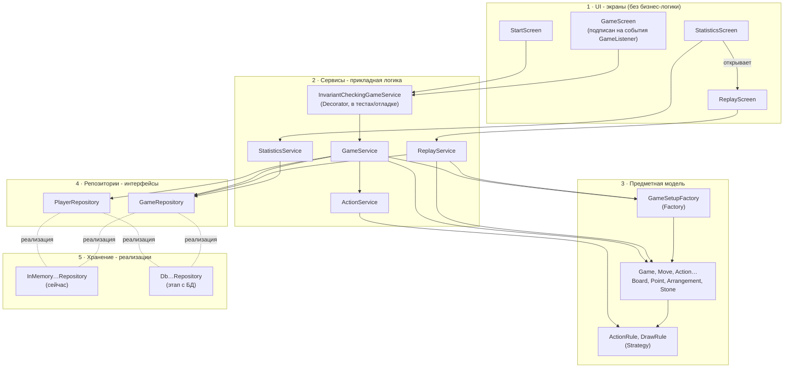
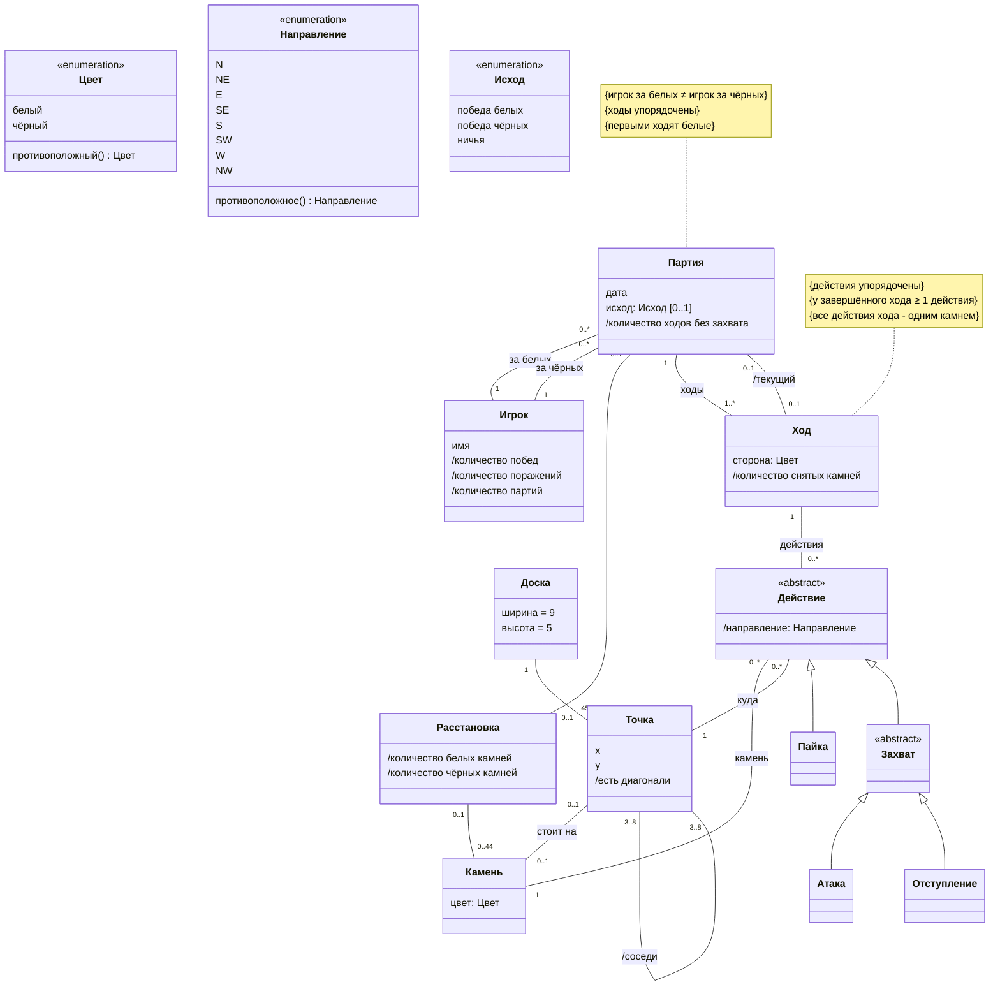

# FanoronaCase

Десктопное приложение для администрирования партий в Фанорону: проверка и запись ходов, промежуточные результаты, история игр и статистика игроков.

## Требования

<details>
<summary>Показать требования</summary>

### Правила игры

- Партия начинается с равного количества камней, расположенных на всех точках, кроме центральной.
- Игроки ходят по очереди, первыми - белые.
- Ход - это либо простое перемещение («пайка»), либо захват: «атака» или «отступление».
- Все действия выполняются по линии на соседнюю свободную точку.
- Пайка - единственное действие хода, после неё ход заканчивается.
- За ход можно (не обязательно) сделать несколько захватывающих действий подряд, но:
  - одним и тем же камнем;
  - не посещая одну и ту же точку, включая ту, где камень стоял в начале хода;
  - не перемещаясь два раза подряд в одном направлении.
- **Атака:** камень подходит к камню противника, и снимаются все камни противника подряд в направлении движения - до первой пустой точки или точки, занятой камнем ходящего.
- **Отступление:** камень отходит от камня противника, и по тому же правилу остановки снимаются камни противника, стоящие подряд в противоположном направлении от исходной точки.
- Захват обязателен: если захват возможен, игрок обязан его сделать. Если доступны и атака, и отступление, игрок выбирает сам.

### Доска

- 9 × 5 точек, соединённых линиями, которые задают направления ходов.
- У каждой стороны 22 камня; в среднем ряду камни стоят чередуясь.
- Соединения образуют 8 участков 3 × 3. В каждом участке последовательно связаны крайние точки, и все они связаны с центральной точкой участка.

### Завершение партии

- Игрок побеждает, если захватил все камни противника.
- Ничья объявляется, если выполнено любое из условий:
  - сделано 40 ходов подряд без единого захвата;
  - одна и та же расстановка камней с той же очередью хода возникла в третий раз.
- Способ определения ничьей может быть не единственным.

### Что делает система во время партии

- Допускает только действия, разрешённые правилами; недопустимое действие отклоняется и не меняет расстановку.
- На каждом ходу определяет, чей ход и какие действия доступны игроку.
- После каждого хода пересчитывает:
  - очередь хода;
  - число оставшихся камней у каждой стороны;
  - число камней, снятых этим ходом;
  - число ходов подряд без захвата.

### История партий

- Каждая завершённая партия сохраняется: последовательность ходов в порядке совершения, распределение цветов между участниками, исход (победа одной из сторон или ничья) и дата.
- Для каждого хода известно, какой стороной он сделан и из каких перемещений состоит.
- Сохранённую партию можно воспроизвести ход за ходом с начальной расстановки.
- Каждая партия связана с двумя участниками.
- Между партиями расстановка сбрасывается до стартовой, распределение цветов задаётся заново.
- Одновременно идёт не более одной партии.

### Участники и статистика

- В партии участвуют два человека; они выбирают цвет, у каждого есть имя.
- Статистика участника: количество побед, количество поражений и общее количество партий. Количество ничьих вычисляется как разность между общим количеством партий и суммой побед и поражений.
- Очков за результат нет.

</details>

## Архитектура

### Слои



### Предметная модель



### Диаграмма классов

```mermaid
classDiagram
    direction TB

    namespace UI {
        class StartScreen
        class GameScreen {
            +onGameChanged(game: Game)
        }
        class StatisticsScreen
        class ReplayScreen
    }

    namespace Services {
        class IGameService {
            <<interface>>
            +startGame(whiteName: String, blackName: String) Game
            +perform(action: Action) List~Violation~
            +endMove()
            +availableActions() List~Action~
            +currentGame() Game?
            +addListener(listener: GameListener)
        }
        class GameService
        class GameServiceDecorator {
            <<abstract>>
            #inner: IGameService
        }
        class InvariantCheckingGameService
        class GameListener {
            <<interface>>
            +onGameChanged(game: Game)
        }
        class ActionService {
            +validate(action: Action, game: Game) List~Violation~
            +availableActions(game: Game) List~Action~
            +canContinueMove(game: Game) Boolean
        }
        class ReplayService {
            +load(gameId: Long)
            +stepForward()
            +stepBack()
            +currentArrangement() Arrangement
        }
        class StatisticsService {
            +statisticsFor(player: Player) PlayerStatistics
            +gamesOf(player: Player) List~Game~
        }
        class PlayerStatistics {
            <<data>>
            +wins: Int
            +losses: Int
            +games: Int
            +/draws: Int
        }
    }

    namespace Repositories {
        class PlayerRepository {
            <<interface>>
            +findAll() List~Player~
            +findByName(name: String) Player?
            +save(player: Player)
        }
        class GameRepository {
            <<interface>>
            +save(game: Game)
            +findById(id: Long) Game?
            +findByPlayer(player: Player) List~Game~
            +findMoves(gameId: Long) List~Move~
        }
        class InMemoryPlayerRepository
        class InMemoryGameRepository
    }

    namespace Rules {
        class ActionRule {
            <<interface>>
            +check(action: Action, game: Game, board: Board) Violation?
        }
        class AlongLineToFreeNeighborRule
        class SameStoneInSeriesRule
        class NoRevisitRule
        class NoRepeatDirectionRule
        class MandatoryCaptureRule
        class SinglePaikaRule
        class DrawRule {
            <<interface>>
            +isDraw(game: Game) Boolean
        }
        class NoCaptureLimitRule {
            +limit: Int = 40
        }
        class RepetitionRule {
            +times: Int = 3
        }
        class Violation {
            <<data>>
            +message: String
        }
    }

    namespace Setup {
        class GameSetupFactory {
            <<interface>>
            +createBoard() Board
            +createInitialArrangement(board: Board) Arrangement
            +createDrawRules() List~DrawRule~
            +createActionRules() List~ActionRule~
        }
        class ClassicFanoronaFactory
        class PositionFactory {
            +description: String
        }
    }

    namespace Domain {
        class Game {
            +id: Long
            +date: LocalDate
            +outcome: Outcome?
            +currentMove() Move?
            +startNextMove()
            +updateOutcome()
            +/movesWithoutCapture() Int
        }
        class Player {
            +name: String
        }
        class Board {
            +width: Int = 9
            +height: Int = 5
            +pointAt(x: Int, y: Int) Point?
            +neighbors(point: Point) List~Point~
            +next(point: Point, direction: Direction) Point?
        }
        class Point {
            +x: Int
            +y: Int
            +/hasDiagonals() Boolean
            +directionTo(other: Point) Direction?
        }
        class Arrangement {
            +stoneAt(point: Point) Stone?
            +pointOf(stone: Stone) Point?
            +move(stone: Stone, to: Point)
            +remove(stones: List~Stone~)
            +/count(color: Color) Int
        }
        class Stone {
            +color: Color
        }
        class Move {
            +side: Color
            +/capturedCount() Int
            +/visitedPoints() List~Point~
            +/lastDirection() Direction?
        }
        class Action {
            <<abstract>>
            +apply(arrangement: Arrangement, board: Board) List~Stone~
            +/direction(arrangement: Arrangement) Direction?
        }
        class Paika
        class Capture {
            <<abstract>>
            #capturedStones(from: Point, arrangement: Arrangement, board: Board) List~Stone~
        }
        class Approach
        class Withdrawal
        class Color {
            <<enumeration>>
            WHITE
            BLACK
            +opposite() Color
        }
        class Direction {
            <<enumeration>>
            N, NE, E, SE, S, SW, W, NW
            +dx: Int
            +dy: Int
            +opposite() Direction
        }
        class Outcome {
            <<enumeration>>
            WHITE_WIN
            BLACK_WIN
            DRAW
        }
    }

    %% UI -> Services
    StartScreen ..> IGameService
    GameScreen ..> IGameService
    GameListener <|.. GameScreen
    StatisticsScreen ..> StatisticsService
    StatisticsScreen ..> ReplayScreen : открывает
    ReplayScreen ..> ReplayService

    %% Decorator
    IGameService <|.. GameService
    IGameService <|.. GameServiceDecorator
    GameServiceDecorator <|-- InvariantCheckingGameService
    GameServiceDecorator o-- "1" IGameService : inner
    GameService o-- "0..*" GameListener

    %% Service dependencies
    GameService ..> PlayerRepository
    GameService ..> GameRepository
    GameService ..> ActionService
    GameService ..> GameSetupFactory
    ActionService o-- "1..*" ActionRule
    ActionService --> "1" Board
    ReplayService ..> GameRepository
    ReplayService ..> GameSetupFactory
    StatisticsService ..> GameRepository
    StatisticsService ..> PlayerStatistics

    %% Repositories
    PlayerRepository <|.. InMemoryPlayerRepository
    GameRepository <|.. InMemoryGameRepository

    %% Strategy
    ActionRule <|.. AlongLineToFreeNeighborRule
    ActionRule <|.. SameStoneInSeriesRule
    ActionRule <|.. NoRevisitRule
    ActionRule <|.. NoRepeatDirectionRule
    ActionRule <|.. MandatoryCaptureRule
    ActionRule <|.. SinglePaikaRule
    DrawRule <|.. NoCaptureLimitRule
    DrawRule <|.. RepetitionRule
    ActionRule ..> Violation

    %% Factory
    GameSetupFactory <|.. ClassicFanoronaFactory
    GameSetupFactory <|.. PositionFactory

    %% Domain
    Game "0..*" --> "1" Player : white
    Game "0..*" --> "1" Player : black
    Game "0..1" --> "0..1" Arrangement
    Game "1" *-- "1..*" Move : moves
    Game o-- "1..*" DrawRule : drawRules
    Board "1" *-- "45" Point
    Arrangement "0..1" --> "0..44" Stone
    Move "1" *-- "0..*" Action : actions
    Action "0..*" --> "1" Stone : stone
    Action "0..*" --> "1" Point : target
    Action <|-- Paika
    Action <|-- Capture
    Capture <|-- Approach
    Capture <|-- Withdrawal
```



## Запуск

Требуется JDK 24; Gradle скачивается через wrapper.

```bash
./gradlew build   # компиляция и тесты
```

Точка входа - `src/main/kotlin/Main.kt`.
